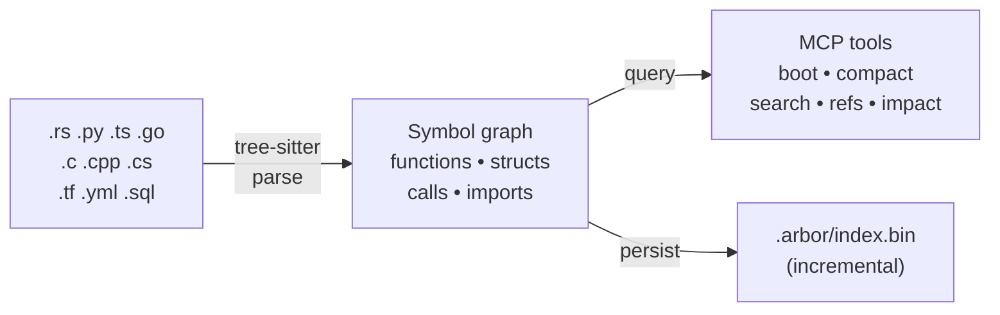
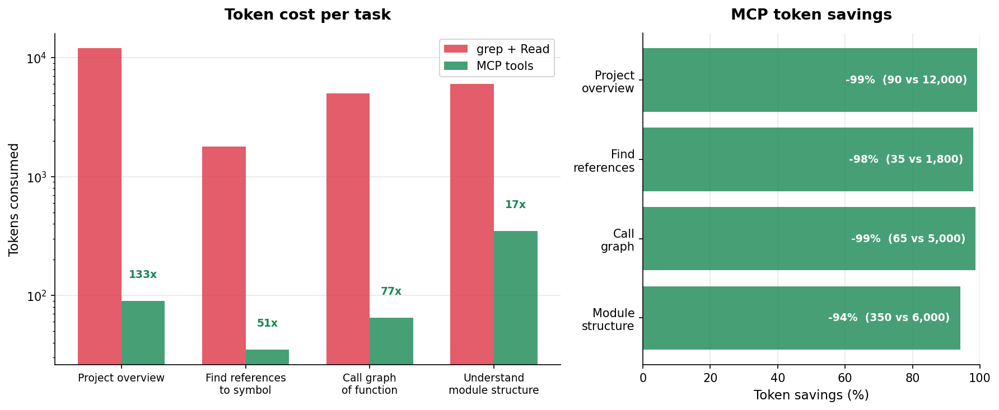
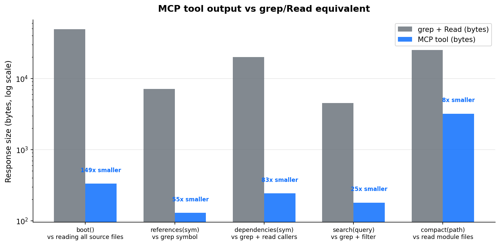
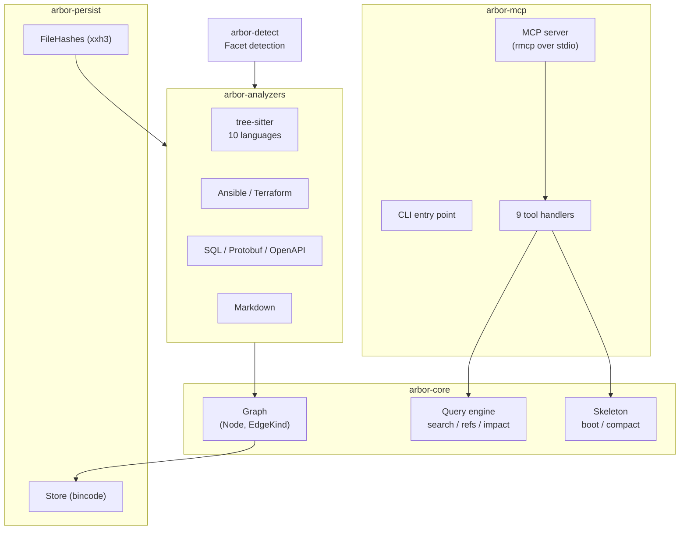

<p align="center">
  <picture>
    <source media="(prefers-color-scheme: dark)" srcset="docs/logo-dark.svg">
    <source media="(prefers-color-scheme: light)" srcset="docs/logo-light.svg">
    
  </picture>
</p>

<p align="center">
  <strong>Fit your entire codebase into an LLM's context window.</strong>
</p>

<p align="center">
  <a href="#quick-start">Quick Start</a> &bull;
  <a href="#highlights">Why arbor</a> &bull;
  <a href="#mcp-tools">Tools</a> &bull;
  <a href="#performance">Performance</a> &bull;
  <a href="#supported-languages">Languages</a>
</p>

<p align="center">
  <a href="https://buymeacoffee.com/nick_voronoy"></a>
</p>

<p align="center">
  <!-- LANGUAGES_BADGE:START --><!-- LANGUAGES_BADGE:END -->
  
  
  
</p>

<p align="center">
  
</p>

---

## Highlights

- **1M lines of code &rarr; 500 lines of context.** arbor builds a symbol graph with tree-sitter and compresses it into token-efficient summaries an LLM can actually use.
- **9 surgical MCP tools.** The LLM sees architecture first, then drills into exactly what it needs &mdash; no grep noise, no wasted tokens.
- **Sub-second incremental re-index.** Only changed files are re-analyzed via content hashing. Cold index of a 1M LOC project takes under 10 seconds.
- **15 languages and formats.** Rust, Python, TypeScript, Go, C/C++, C#, Kotlin, plus Terraform, Ansible, SQL, Protobuf, OpenAPI, and Markdown.
- **Zero configuration.** One install command. No config files. Works with any project structure.

```
bevy (1,756 files, 21,863 functions, ~1.1M LOC)
  boot screen:      16 lines   ~400 tokens
  compact skeleton:  552 lines  ~9k tokens
  indexed in:        9.5 seconds
```

## Quick Start

One command &mdash; installs arbor and connects it to Claude Code:

**macOS / Linux:**
```bash
curl -fsSL https://raw.githubusercontent.com/nikita-voronoy/arbor/main/install.sh | bash
```

**Windows (PowerShell):**
```powershell
irm https://raw.githubusercontent.com/nikita-voronoy/arbor/main/install.ps1 | iex
```

<details>
<summary>Manual install</summary>

```bash
# Build from source
cargo install --git https://github.com/nikita-voronoy/arbor.git arbor-mcp

# Add to Claude Code
claude mcp add arbor -- arbor
```

</details>

That's it. Claude will call `boot` &rarr; `compact` &rarr; `search` &rarr; `references` as needed.

### CLI mode

```bash
arbor /path/to/project --cli       # Architecture overview
arbor /path/to/project --compact   # Token-optimized skeleton
```

## How It Works



1. **Index** &mdash; tree-sitter parses source files into ASTs. arbor extracts functions, structs, traits, enums, calls, imports, and type references.
2. **Persist** &mdash; the graph is saved to `.arbor/`. On re-index, only changed files are re-analyzed (xxh3 content hashing).
3. **Serve** &mdash; 9 MCP tools let the LLM explore the graph at any granularity.
4. **Resolve** &mdash; cross-file call edges are resolved in a second pass after all files are indexed.

## MCP Tools

| Tool | What it does | Typical tokens |
|------|-------------|---------------:|
| **`boot`** | Architecture overview: modules, key types, hub functions | ~150&ndash;400 |
| **`skeleton`** | Full symbol tree with signatures, organized by file | ~2k&ndash;20k |
| **`compact`** | Token-optimized skeleton: one-line sigs, no tests, collapsed enums | ~500&ndash;9k |
| **`search`** | Fuzzy symbol search &mdash; exact &rarr; prefix &rarr; contains | varies |
| **`references`** | All refs to a symbol: definitions, calls, imports, type refs, impls | varies |
| **`dependencies`** | What does this symbol depend on? (transitive, configurable depth) | varies |
| **`impact`** | What breaks if this symbol changes? (reverse dependency traversal) | varies |
| **`tunnels`** | Cross-project shared types in multi-repo mode | varies |
| **`reindex`** | Full re-index from scratch | &mdash; |

## Performance

Tested on real-world projects (Apple Silicon, parallel parsing with rayon):

| Project | Files | Functions | LOC | Index time | Compact output |
|---------|------:|----------:|----:|:----------:|:--------------:|
| **arbor** | 57 | 244 | 12k | 0.4s | 141 lines |
| **tokio** | 776 | 6,901 | 314k | 2.9s | 623 lines |
| **bevy** | 1,756 | 21,863 | 1.1M | 9.5s | 552 lines |
| **dotnet/runtime** | 37,581 | 522,691 | 28M | 29s | 561 lines |

Incremental re-index (only changed files) is typically **&lt;100ms**.

<details>
<summary>Token efficiency: arbor vs grep + file reads</summary>

arbor's MCP tools return structured, compressed output &mdash; dramatically fewer tokens than raw grep + file reads for the same information.





</details>

## Supported Languages

<!-- LANGUAGES_TABLE:START -->
| Language | Functions | Structs | Traits | Enums | Calls | Imports |
|----------|:---------:|:-------:|:------:|:-----:|:-----:|:-------:|
| Rust | ✓ | ✓ | ✓ | ✓ | ✓ | ✓ |
| Python | ✓ | ✓ | — | — | ✓ | ✓ |
| TypeScript | ✓ | ✓ | ✓ | ✓ | ✓ | ✓ |
| JavaScript | ✓ | ✓ | — | — | ✓ | ✓ |
| Go | ✓ | ✓ | — | — | ✓ | ✓ |
| C | ✓ | ✓ | — | ✓ | ✓ | ✓ |
| C++ | ✓ | ✓ | — | ✓ | ✓ | ✓ |
| C# | ✓ | ✓ | ✓ | ✓ | ✓ | ✓ |
| Kotlin | ✓ | ✓ | ✓ | ✓ | ✓ | ✓ |
<!-- LANGUAGES_TABLE:END -->

<details>
<summary>Non-code formats</summary>

| Format | What it indexes |
|--------|----------------|
| Ansible | roles, tasks, handlers, variables, templates, playbooks |
| Terraform | resources, variables, outputs, modules, data sources |
| SQL | tables, columns, foreign keys |
| Protobuf | messages, services, RPCs |
| OpenAPI | endpoints, schemas |
| Markdown | documents, sections, links |

</details>

<details>
<summary>Architecture</summary>



</details>

## License

MIT &mdash; see [LICENSE](LICENSE).

---

<p align="center">
  Built with <a href="https://tree-sitter.github.io/">tree-sitter</a> and <a href="https://modelcontextprotocol.io/">MCP</a>
</p>
