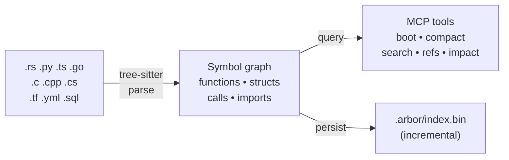

<p align="center">
  <picture>
    <source media="(prefers-color-scheme: dark)" srcset="docs/logo-dark.svg">
    <source media="(prefers-color-scheme: light)" srcset="docs/logo-light.svg">
    
  </picture>
</p>

<p align="center">
  <strong>Fit your entire codebase into an LLM's context window.</strong>
</p>

<p align="center">
  <a href="#quick-start">Quick Start</a> &bull;
  <a href="#highlights">Why arbor</a> &bull;
  <a href="#configuration-examples">Configuration</a> &bull;
  <a href="#mcp-tools">Tools</a> &bull;
  <a href="#performance">Performance</a> &bull;
  <a href="#supported-languages">Languages</a>
</p>

<p align="center">
  <a href="https://buymeacoffee.com/nick_voronoy"></a>
</p>

<p align="center">
  <!-- LANGUAGES_BADGE:START --><!-- LANGUAGES_BADGE:END -->
  
  <!-- TOOLS_BADGE:START --><!-- TOOLS_BADGE:END -->
  
</p>

<p align="center">
  
</p>

---

## Highlights

- **1M lines of code &rarr; 500 lines of context.** arbor builds a symbol graph with tree-sitter and compresses it into token-efficient summaries an LLM can actually use.
- **14 surgical MCP tools.** The LLM sees architecture first, then drills into exactly what it needs &mdash; no grep noise, no wasted tokens.
- **Sub-second incremental re-index.** Only changed files are re-analyzed via content hashing. Cold index of a 1M LOC project takes under 10 seconds.
- **15 languages and formats.** Rust, Python, TypeScript, Go, C/C++, C#, Kotlin, plus Terraform, Ansible, SQL, Protobuf, OpenAPI, and Markdown.
- **Zero configuration.** One install command. No config files. Works with any project structure.

```
bevy (1,756 files, 21,863 functions, ~1.1M LOC)
  boot screen:      16 lines   ~400 tokens
  compact skeleton:  552 lines  ~9k tokens
  indexed in:        9.5 seconds
```

## Quick Start

One command &mdash; installs arbor and connects it to Claude Code:

**macOS / Linux:**
```bash
curl -fsSL https://raw.githubusercontent.com/nikita-voronoy/arbor/main/scripts/install.sh | bash
```

**Windows (PowerShell):**
```powershell
irm https://raw.githubusercontent.com/nikita-voronoy/arbor/main/scripts/install.ps1 | iex
```

<details>
<summary>Manual install</summary>

```bash
# Build from source
cargo install --git https://github.com/nikita-voronoy/arbor.git arbor-mcp

# Add to Claude Code
claude mcp add arbor -- arbor
```

</details>

That's it. Claude will call `boot` &rarr; `compact` &rarr; `search` &rarr; `source` &rarr; `callers` as needed.

### CLI mode

```bash
arbor /path/to/project --cli       # Architecture overview
arbor /path/to/project --compact   # Token-optimized skeleton
```

## Configuration Examples

The installer configures everything automatically, but here's what it sets up and how to customize it.

<details>
<summary><strong>Claude Code (MCP server)</strong></summary>

The installer registers arbor as an MCP server:

```bash
claude mcp add arbor -- arbor
```

Verify it's registered:

```bash
claude mcp list
```

</details>

<details>
<summary><strong>PreToolUse hook &mdash; steer Claude toward arbor</strong></summary>

The installer adds a hook to `~/.claude/settings.json` that nudges Claude to use arbor instead of raw grep/glob:

```json
{
  "hooks": {
    "PreToolUse": [
      {
        "matcher": "Grep|Glob",
        "hooks": [
          {
            "type": "command",
            "command": "echo '{\"hookSpecificOutput\":{\"hookEventName\":\"PreToolUse\",\"additionalContext\":\"STOP: Prefer arbor MCP tools (search, source, callers, references, skeleton, compact, boot) over Grep/Glob for code navigation. Fall back to Grep/Glob only for string literals, comments, or regex patterns.\"}}'",
            "statusMessage": "Checking arbor preference..."
          }
        ]
      }
    ]
  }
}
```

This doesn't block grep &mdash; it adds context that helps Claude choose the right tool.

</details>

<details>
<summary><strong>CLAUDE.md instructions</strong></summary>

The installer appends a block to `~/.claude/CLAUDE.md` that teaches Claude when to use each arbor tool:

```markdown
## Code navigation: use arbor MCP first

- **Instead of grep for a symbol** → use `mcp__arbor__search`
- **Instead of grep for "who calls X"** → use `mcp__arbor__callers`
- **Instead of reading a function's code** → use `mcp__arbor__source`
- **Instead of reading many files** → use `mcp__arbor__boot`, then `mcp__arbor__skeleton` or `mcp__arbor__compact`
- **Instead of reading one file** → use `mcp__arbor__summary`
- **Instead of tracing dependencies** → use `mcp__arbor__dependencies` or `mcp__arbor__impact`
- **To list all types/traits/functions** → use `mcp__arbor__symbols`
- **After making changes** → call `mcp__arbor__reindex`

Start every session with `mcp__arbor__boot`.
```

You can edit `~/.claude/CLAUDE.md` to fine-tune this behavior. For project-specific instructions, add a `CLAUDE.md` in the project root.

</details>

<details>
<summary><strong>Multi-project workspace</strong></summary>

arbor auto-detects the project root from the working directory. For monorepos with multiple languages, it indexes all detected facets automatically:

```bash
# Index from repo root — detects Rust + TypeScript + Terraform + Markdown
arbor /path/to/monorepo --compact
```

For separate repos that share types, use the `tunnels` tool to discover cross-project connections.

</details>

<details>
<summary><strong>IDE integration (VS Code / JetBrains)</strong></summary>

arbor works through Claude Code's IDE extensions. After installing arbor:

1. Install the [Claude Code extension](https://marketplace.visualstudio.com/items?itemName=anthropic.claude-code) for your IDE
2. arbor is automatically available &mdash; Claude will use `boot` and `compact` to understand your project

No additional IDE configuration needed.

</details>

<details>
<summary><strong>Uninstall</strong></summary>

**macOS / Linux:**
```bash
curl -fsSL https://raw.githubusercontent.com/nikita-voronoy/arbor/main/scripts/uninstall.sh | bash
```

**Windows (PowerShell):**
```powershell
irm https://raw.githubusercontent.com/nikita-voronoy/arbor/main/scripts/uninstall.ps1 | iex
```

This removes the binary, MCP registration, hooks, and CLAUDE.md instructions.

</details>

## How It Works



1. **Index** &mdash; tree-sitter parses source files into ASTs. arbor extracts functions, structs, traits, enums, calls, imports, and type references.
2. **Persist** &mdash; the graph is saved to `.arbor/`. On re-index, only changed files are re-analyzed (xxh3 content hashing).
3. **Serve** &mdash; 14 MCP tools let the LLM explore the graph at any granularity.
4. **Resolve** &mdash; cross-file call edges are resolved in a second pass after all files are indexed.

## MCP Tools

<!-- TOOLS_TABLE:START -->
| Tool | What it does |
|------|-------------|
| **`boot`** | Get a compact boot screen overview of the project (~170 tokens): project type, file/function/struct counts, top-level modules, key public types. Call this first. |
| **`skeleton`** | Get a compact skeleton showing all symbols (functions, structs, traits, enums) organized by file. Optionally filter by path prefix and control depth. |
| **`compact`** | Get a ultra-compact token-optimized skeleton. Uses abbreviated tags (fn/st/tr/en) and compressed signatures. Best for large codebases where full skeleton is too verbose. |
| **`references`** | Find all references to a symbol: definitions, calls, imports, type refs, implementations. Returns file locations and reference kinds. |
| **`dependencies`** | Get transitive dependencies of a symbol. Direction 'outgoing' (default) shows what it depends on; 'incoming' shows what depends on it. |
| **`impact`** | Impact analysis: find everything that would be affected if the given symbol changes. Shows all transitive dependents. |
| **`search`** | Fuzzy search for symbols by name substring. Set sig=true to search in signatures instead (e.g. find all functions taking `Palace` as a parameter). Results ranked: exact > prefix > contains. |
| **`source`** | Show the source code of a symbol (function, struct, trait, etc.) by name. Returns the actual implementation with line numbers. Use this instead of reading whole files when you know the symbol name. |
| **`callers`** | Find all functions that call a given symbol. Returns caller names with file locations. Simpler than 'references' when you just need to know who calls what. |
| **`summary`** | Get a rich summary of a single file: all symbols with signatures, visibility, and call relationships. More detailed than skeleton for a specific file. |
| **`symbols`** | List all symbols of a given kind across the project. Kinds: fn, struct, trait, enum, macro, module, or 'all'. Useful for getting a project-wide view of types, traits, or entry points. |
| **`implementations`** | Find all types that implement a given trait. Returns implementor names with file locations. |
| **`reindex`** | Re-index the project from scratch. Use after significant file changes. |
| **`tunnels`** | Show cross-project tunnels: shared types and symbols that connect different wings (projects) in a multi-project palace. |
<!-- TOOLS_TABLE:END -->

## Performance

Tested on real-world projects (Apple Silicon, parallel parsing with rayon):

| Project | Files | Functions | LOC | Index time | Compact output |
|---------|------:|----------:|----:|:----------:|:--------------:|
| **arbor** | 57 | 244 | 12k | 0.4s | 141 lines |
| **tokio** | 776 | 6,901 | 314k | 2.9s | 623 lines |
| **bevy** | 1,756 | 21,863 | 1.1M | 9.5s | 552 lines |
| **dotnet/runtime** | 37,581 | 522,691 | 28M | 29s | 561 lines |

Incremental re-index (only changed files) is typically **&lt;100ms**.

<details>
<summary>Token efficiency: arbor vs grep + file reads</summary>

arbor's MCP tools return structured, compressed output &mdash; dramatically fewer tokens than raw grep + file reads for the same information.


</details>

## Supported Languages

<!-- LANGUAGES_TABLE:START -->
| Language | Functions | Structs | Traits | Enums | Calls | Imports |
|----------|:---------:|:-------:|:------:|:-----:|:-----:|:-------:|
| Rust | ✓ | ✓ | ✓ | ✓ | ✓ | ✓ |
| Python | ✓ | ✓ | — | — | ✓ | ✓ |
| TypeScript | ✓ | ✓ | ✓ | ✓ | ✓ | ✓ |
| JavaScript | ✓ | ✓ | — | — | ✓ | ✓ |
| Go | ✓ | ✓ | — | — | ✓ | ✓ |
| C | ✓ | ✓ | — | ✓ | ✓ | ✓ |
| C++ | ✓ | ✓ | — | ✓ | ✓ | ✓ |
| C# | ✓ | ✓ | ✓ | ✓ | ✓ | ✓ |
| Kotlin | ✓ | ✓ | ✓ | ✓ | ✓ | ✓ |
| Java | ✓ | ✓ | ✓ | ✓ | ✓ | ✓ |
<!-- LANGUAGES_TABLE:END -->

<details>
<summary>Non-code formats</summary>

| Format | What it indexes |
|--------|----------------|
| Ansible | roles, tasks, handlers, variables, templates, playbooks |
| Terraform | resources, variables, outputs, modules, data sources |
| SQL | tables, columns, foreign keys |
| Protobuf | messages, services, RPCs |
| OpenAPI | endpoints, schemas |
| Markdown | documents, sections, links |

</details>

<details>
<summary>Architecture</summary>


</details>

## License

MIT &mdash; see [LICENSE](LICENSE).

---

<p align="center">
  Built with <a href="https://tree-sitter.github.io/">tree-sitter</a> and <a href="https://modelcontextprotocol.io/">MCP</a>
</p>
